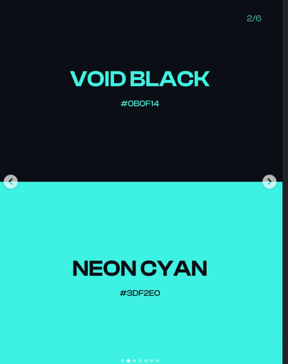
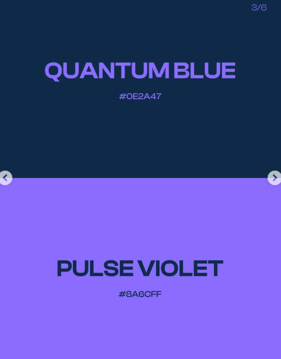
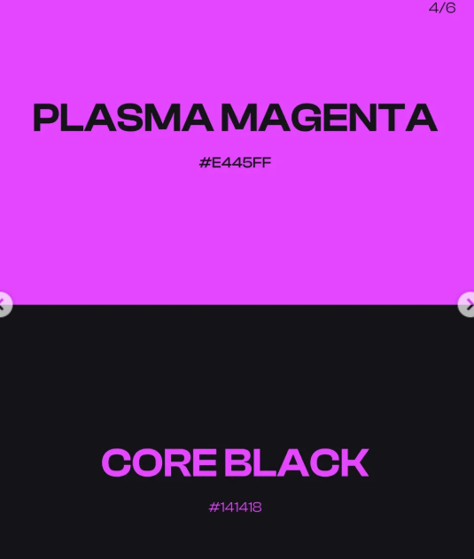
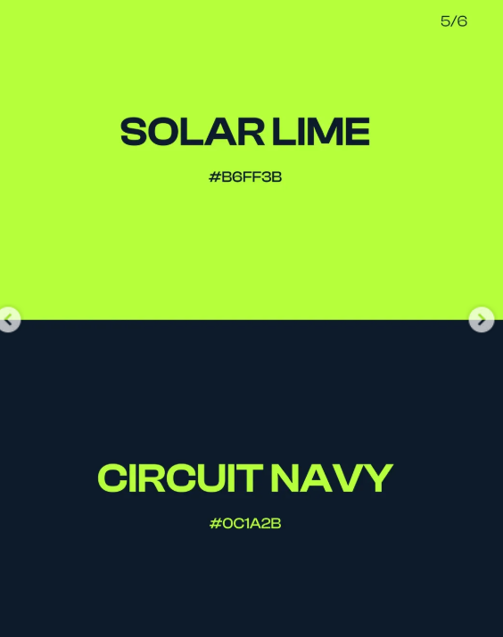
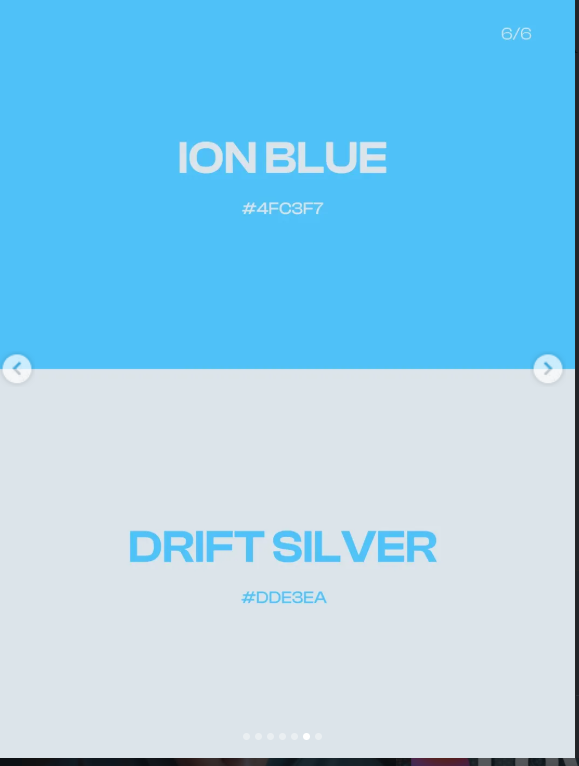

# Design Resources, Skills & Inspiration

Everything for making interfaces look professionally designed. Build methods: [[website-building-methods]]; full prompts: [[design-prompts]].

## 5 sites coders should know

- **style.refero.design** — design inspiration: colors, typography, spacing, UI patterns; also works as a design reference to feed into AI assistants for better design taste
- **ui.aceternity.com** — 200+ stunning animated React components (Tailwind CSS + Framer Motion)
- **ui.shadcn.com** — copy-pasteable React components, highly customizable, integrate seamlessly
- **mobbin.com** — massive repository of mobile/web UI screenshots from popular real-world apps (like Spotify) for design inspiration
- **haikei.app** — interactive generator for unique SVG backgrounds, waves, gradients, and geometric shapes
- **componentry.fun** — free React components and effects
- **manus.im** — AI website/app builder from prompts
- **dotmatrix.zzzshawn.com** — dot matrix loaders for React

Main uses: design inspiration, ready-made UI components, animations, AI-assisted website building, loading states / UI polish.

## Claude Code design skills

Skills that help non-designers make better UI (goal: interfaces that look professionally designed):

- **Impeccable** — kills AI slop; improves typography, color, spacing, layout (23 commands)
- **UI/UX Pro Max** — pro UX design skill
- **Taste** — actual design taste; makes output feel less generic/AI-looking
- **Huashu-design**
- **Emil Kowalski skill** — adds better motion, easing, animations
- **make-interfaces-feel-better** — uses design heuristics (not preset styles) to improve layout, spacing, hierarchy, and overall feel; reduces generic "AI slop" UI. Teaches the agent how to make better design decisions. ([github.com/jakubkrehel/make-interfaces-feel-better](https://github.com/jakubkrehel/make-interfaces-feel-better))
- **/polish** — checks and tightens UI before shipping
- **Playwright** — so Claude can *see* what it ships

## MCP setup for better design output

Setup to improve Claude's web and app design output:
1. Install a pro UX design skill
2. Add the **Google Stitch MCP**
3. Add the **Nano Banana 2 MCP**
4. Use the **21st.dev** asset library for 3D/reactive components
5. Combine all for better UI, patterns, assets, and design quality

## Claude Design → editable Canva templates

Use Claude Design + the Canva connector to create editable Canva templates:
1. Open the Claude dashboard → Customize → Skills → Connectors → connect Canva
2. Open Claude Design, create a project (e.g. Instagram Carousel), choose **High Fidelity**
3. Upload screenshots/mood board and answer Claude's clarification questions
4. Export the design to Canva, then edit colors, fonts, and text there

## Pretty colour palettes

Saved palette references (from a design reel):

## Saved UX reference reels (Instagram)

Link rot warning: these are IG links saved for the technique named in the title.

- [Beautiful design styles](https://www.instagram.com/p/DT7pQUkjxbo/)
- [Beautiful design principles — human touch](https://www.instagram.com/p/DUnbfc8D8eu/)
- [Div corners](https://www.instagram.com/p/DVZOM4HDJif/)
- [Loading spinners principles](https://www.instagram.com/p/DYkRtX1oKKN/)
- [Pricing cards design](https://www.instagram.com/p/DUf3nehjIg7/)
- [Reduce user frustration when filling out forms](https://www.instagram.com/p/DYyzrdpIixM/)
